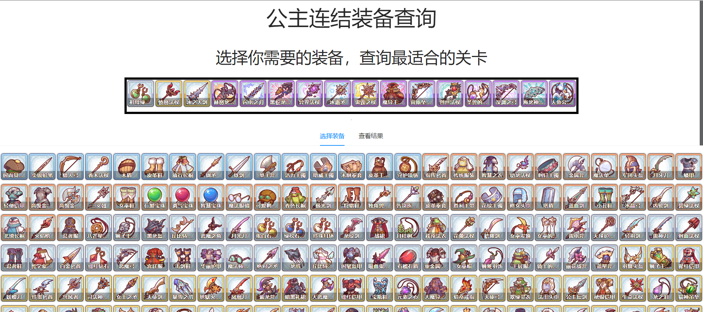
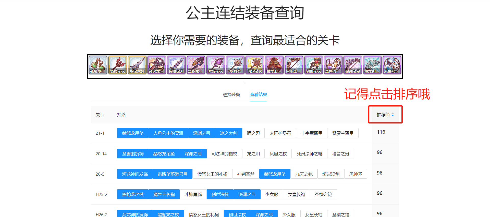

# 公主链接装备获取关卡查询器

## 食用方法
选择需要的装备

查看关卡推荐

## 项目构建
In the project directory, you can run:

### `npm start`

Runs the app in the development mode.\
Open [http://localhost:3000](http://localhost:3000) to view it in the browser.

### `npm run build`

Builds the app for production to the `build` folder.\
It correctly bundles React in production mode and optimizes the build for the best performance.

The build is minified and the filenames include the hashes.\
Your app is ready to be deployed!

## 更新计划
1. 调整页面样式
2. 添加介绍页面
3. 改下遍历算法，减少卡顿
4. 结果页面也改为显示图标
5. 自动排序推荐

## 支持作者

